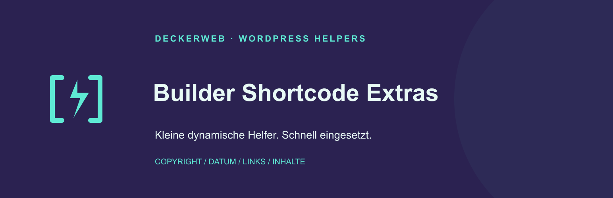
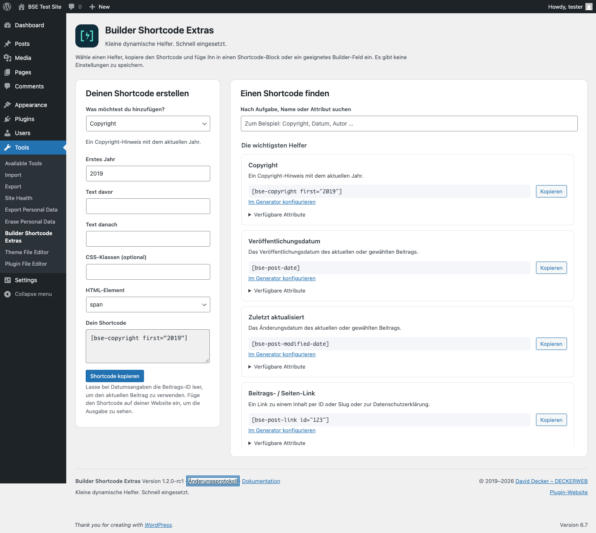

# Builder Shortcode Extras

**Kleine dynamische Helfer. Schnell eingesetzt.**

Copyright, Datumsangaben, Links und wiederverwendbare Inhalte ohne eigenes PHP. Mit einer durchsuchbaren Hilfe und einem kompakten Generator direkt in WordPress.

Version **1.2.0** · WordPress **6.7+** · PHP **8.0+** · GPL-2.0-or-later



[English](README.md) · [Anleitung & FAQ](docs/Deutsch.md) · [Changelog](docs/CHANGELOG-de.md) · [GitHub Releases](https://github.com/deckerweb/builder-shortcode-extras/releases) · [Support](https://github.com/deckerweb/builder-shortcode-extras/issues)

## Inhalt

- [Schnell starten](#schnell-starten)
- [Beispiele](#beispiele)
- [Updates und Library](#updates-und-library)
- [FAQ](#faq)
- [Changelog](#changelog)



## Schnell starten

1. Lade das Test-ZIP hoch: Plugins → Installieren → Plugin hochladen.
2. Aktiviere das Plugin und öffne Werkzeuge → Builder Shortcode Extras.
3. Suche einen Helfer oder konfiguriere einen der fünf Anwendungsfälle.
4. Kopiere den Shortcode in einen Shortcode-Block oder ein geeignetes Builder-Feld.
5. Prüfe die tatsächliche Ausgabe auf deiner Testseite.

Es gibt keine zusätzlichen BSE-Einstellungen. Die Seite ändert keine Inhalte und speichert keine Generatorwerte.

## Beispiele

```text
[bse-copyright first="2019"]
[bse-post-date format="Y-m-d"]
[bse-post-modified-date label="Zuletzt aktualisiert: "]
[bse-post-link id="123" text="Mehr erfahren"]
[bse-item-content id="123"]
```

## Updates und Library

Der deckerweb Updater integriert stabile GitHub-Releases in die WordPress-Updateverwaltung. Vorabversionen werden manuell installiert. Die eingebettete deckerweb Library 0.2.0 ergänzt einen kuratierten Plugin-Katalog unter Plugins → Installieren; ihre Optionen liegen unter Einstellungen → deckerweb Library. BSE wird durch dieses Testpaket nicht in den Katalog aufgenommen.

## FAQ

### Muss ich das Plugin konfigurieren?

Nein. Öffne Werkzeuge → Builder Shortcode Extras, um einen Shortcode zu finden oder zu erstellen. Die Seite speichert keine Einstellungen.

### Wo füge ich einen Shortcode ein?

In einen WordPress-Shortcode-Block oder ein Builder-Feld mit ausdrücklicher Shortcode-Unterstützung. Beliebige Text-, URL- und HTML-Felder führen Shortcodes nicht automatisch aus.

### Was kann der Generator erstellen?

Copyright, Veröffentlichungsdatum, Änderungsdatum, einen Beitrags-/Seiten-Link und Inhaltseinbettungen. Weitere Helfer findest du in der durchsuchbaren Übersicht.

### Kann ich HTML und Klassen ändern?

Die meisten Texthelfer unterstützen wrapper, class, before und after. Mehrere Klassen sind möglich. Unsichere oder nicht unterstützte Wrapper werden durch span ersetzt. Diese Version ergänzt keinen Modus ohne Wrapper.

### Werden Frontend-CSS oder JavaScript geladen?

Hilfe und Generator laden Ressourcen nur auf ihrer eigenen Admin-Seite. Eingebettete Builder-Vorlagen können Ressourcen ihres Builders laden; das Kommentarformular kann WordPress-Ressourcen benötigen.

### Warum bleibt eine Inhaltseinbettung leer?

Prüfe ID, Veröffentlichungsstatus und erforderlichen Builder. Private, unveröffentlichte, gelöschte oder passwortgeschützte Inhalte werden Besuchern ohne erforderlichen Zugriff nicht ausgegeben. Rekursive Referenzen werden gestoppt.

### Wie funktionieren Updates?

Der mitgelieferte deckerweb Updater prüft das öffentliche GitHub-Repository auf neuere stabile Releases über die normale WordPress-Updateverwaltung. Er installiert keine Vorabversionen automatisch und aktiviert keine automatischen Updates. Testversionen installierst du manuell.

## Changelog

## 1.2.0 — 01.10.2026

- **Neu:** Durchsuchbare Shortcode-Hilfe mit Kopierfunktion und lokalem Generator für Copyright, Veröffentlichungsdatum, Änderungsdatum, Beitragslinks und Inhaltseinbettung.
- **Neu:** deckerweb Plugin Library 0.2.0 und gemeinsamer deckerweb GitHub Release Updater v2 eingebunden.
- **Verbessert:** Einheitliche Wrapper-Prüfung, mehrere CSS-Klassen, boolesche Attribute und bereinigte Textausgabe; Shortcode-Namen, Aliase und Ausgabefilter bleiben erhalten.
- **Verbessert:** Native Blöcke werden gerendert; Builder werden passend zum Inhalt gewählt; direkte und indirekte rekursive Einbettung wird verhindert.
- **Verbessert:** Header/Footer nach Brand Admin Schemes, lokaler Changelog-Dialog, englische/deutsche Dokumentation und aktualisierte deutsche Übersetzungen.
- **Verbessert:** Drei originale skalierbare Icon-/Banner-Entwürfe; Variante A mit dem violetten Hintergrund von B ist ausgewählt.
- **Behoben:** Admin-Registrierung, Rückgabe bereinigter Integrationsdaten und versehentlich registrierter Platzhalter korrigiert.
- **Behoben:** Veröffentlichungsdatum berücksichtigt die Beitrags-ID; Slug-Links werden korrekt aufgelöst; ungültige IDs und unbekannte Zählstatus werden behandelt.
- **Behoben:** Nicht definierte Versionskonstanten, Datenbankversionsabfrage sowie Escaping von Benutzerwerten, Ersatztext, Datumsbeschriftungen, Linktext und Tooltip korrigiert.
- **Behoben:** Website-Änderungsdatum verwendet die WordPress-Zeitzone und liefert bei fehlenden veröffentlichten Inhalten kein falsches Datum.
- **Sonstiges:** Benötigt WordPress 6.7+ und PHP 8.0+; PHP 8.0 wird von der Library vorausgesetzt. Die Helfer-Oberfläche lädt keine Frontend-Ressourcen.
- **Sonstiges:** Genesis und Beaver bleiben erhalten; doppelter Astra-Loader, altes Blocks-Menü und sachfremde Werbe-/Core-Admin-Eingriffe entfernt.

## 1.1.0 — 2025-03-15

- **Verbessert:** Plugin wieder in einen nutzbaren Zustand gebracht.
- **Sonstiges:** Verteilung von WordPress.org zu GitHub verlagert und alten DDWlib-Empfehlungsinstaller entfernt.
- **Sonstiges:** Eigenen Übersetzungsloader entfernt; mitgelieferte Übersetzungen beibehalten.

## 1.0.0 — 2019-09-10

- **Neu:** Erste Veröffentlichung mit 25 allgemeinen Helfern und 5 Integrations-Shortcodes.

## 0.9.0 — 2019-09-09

- **Neu:** Erste öffentliche Beta auf GitHub.

## Über das Plugin

Direkte Verteilung über GitHub. Keine Shortcode-Gestaltungselemente wie Slider oder Akkordeons. Genesis, Beaver, Elementor, Astra und synchronisierte Vorlagen bleiben optionale Integrationen; eine umfassende Builder-Zertifizierung wird nicht behauptet.

© 2019–2026 David Decker – DECKERWEB. GPL-2.0-or-later.
