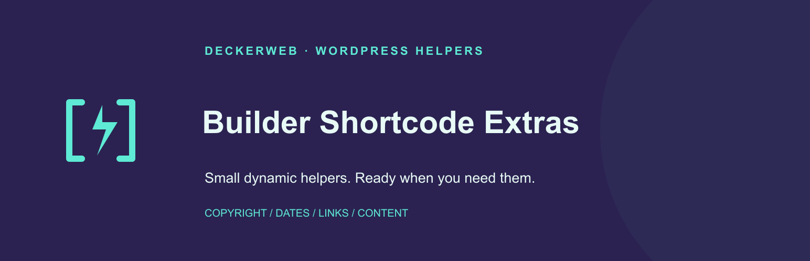
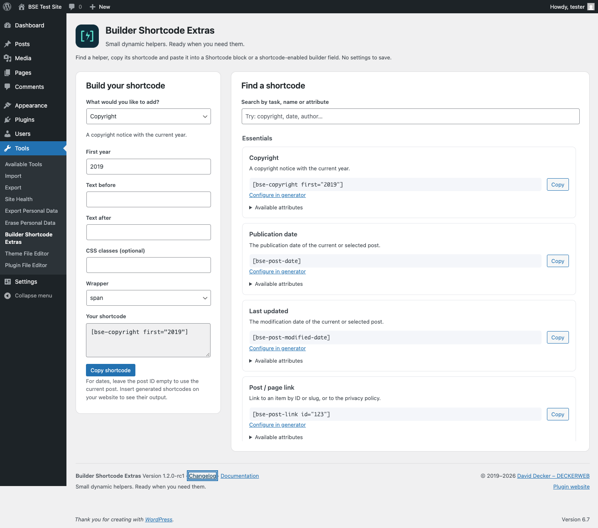

# Builder Shortcode Extras

**Small dynamic helpers. Ready when you need them.**

Copyright, dates, links and reusable content without custom PHP. Includes searchable help and a compact generator directly in WordPress.

Version **1.2.0** · WordPress **6.7+** · PHP **8.0+** · GPL-2.0-or-later



[Deutsch](README-de.md) · [Guide & FAQ](docs/English.md) · [Changelog](docs/CHANGELOG.md) · [GitHub Releases](https://github.com/deckerweb/builder-shortcode-extras/releases) · [Support](https://github.com/deckerweb/builder-shortcode-extras/issues)

## Contents

- [Quick start](#quick-start)
- [Examples](#examples)
- [Updates and Library](#updates-and-library)
- [FAQ](#faq)
- [Changelog](#changelog)



## Quick start

1. Upload the test ZIP through Plugins → Add New → Upload Plugin.
2. Activate it and open Tools → Builder Shortcode Extras.
3. Find a helper or configure one of the five use cases.
4. Copy the shortcode into a Shortcode block or a supported builder field.
5. Check the actual output on your test page.

There are no additional BSE settings. The page does not edit content or save generator values.

## Examples

```text
[bse-copyright first="2019"]
[bse-post-date format="Y-m-d"]
[bse-post-modified-date label="Last updated: "]
[bse-post-link id="123" text="Read more"]
[bse-item-content id="123"]
```

## Updates and Library

The deckerweb updater integrates stable GitHub releases with WordPress updates. Install prereleases manually. Embedded deckerweb Library 0.2.0 adds a curated catalog under Plugins → Add New; its preferences live under Settings → deckerweb Library. This test package does not add BSE to the catalog.

## FAQ

### Do I need to configure the plugin?

No. Open Tools → Builder Shortcode Extras to find or generate a shortcode. The page does not save settings.

### Where do I paste a shortcode?

Use a WordPress Shortcode block or a builder field that explicitly supports shortcodes. Arbitrary text, URL and HTML fields do not necessarily execute them.

### What can the generator create?

Copyright, publication date, last-updated date, a post/page link and embedded content. Other helpers remain available in the searchable catalog.

### Can I change the HTML and classes?

Most text helpers accept wrapper, class, before and after. Multiple classes are supported. Unsafe or unsupported wrapper tags fall back to span. This version does not add a wrapper-free mode.

### Does it load frontend CSS or JavaScript?

The help and generator load assets only on their own admin page. Embedded builder templates may load their builder’s own assets, and the comment form may rely on WordPress resources.

### Why is embedded content empty?

Check the ID, publication status and required builder. Visitors cannot embed private, draft, trashed or password-protected content without the required access. Recursive references stop with empty output.

### How do updates work?

The bundled deckerweb updater checks this public GitHub repository for newer stable releases through the regular WordPress update system. It does not automatically install prereleases or enable automatic updates. Test releases are installed manually.

## Changelog

## 1.2.0 — 2026-10-01

- **New:** Searchable shortcode help with copy buttons and a local generator for copyright, publication date, modification date, post links and embedded content.
- **New:** Embedded deckerweb Plugin Library 0.2.0 and shared deckerweb GitHub Release Updater v2.
- **Improved:** Unified wrapper validation, multiple CSS classes, boolean attributes and escaped text boundaries; existing shortcode names, aliases and output filters remain.
- **Improved:** Native block rendering, builder-specific routing and guarded content embedding with direct/indirect recursion protection.
- **Improved:** Brand Admin Schemes-style header/footer, local changelog dialog, English/German documentation and German/formal German translations.
- **Improved:** Three original scalable icon/banner concepts; selected concept A uses the purple background from concept B.
- **Fixed:** Corrected admin registration policy, persistent integration normalization and placeholder integration registration.
- **Fixed:** Publication dates honor explicit post IDs; slug links resolve correctly; missing IDs and unknown post-count statuses are handled.
- **Fixed:** Undefined version constants, database version lookup, user/fallback escaping, date labels, link text and tooltip escaping.
- **Fixed:** Site-updated dates use the WordPress timezone and return no false date when no published item exists.
- **Misc:** Requires WordPress 6.7+ and PHP 8.0+; the library requires PHP 8.0. No frontend assets are added by the helper UI.
- **Misc:** Retains Genesis and Beaver compatibility, removes the duplicate Astra loader, legacy Blocks menu and unrelated promotion/Core admin overrides.

## 1.1.0 — 2025-03-15

- **Improved:** Restored the plugin to a usable state.
- **Misc:** Moved distribution away from WordPress.org and removed the old DDWlib recommendation installer.
- **Misc:** Removed the custom translation loader; retained packaged translations.

## 1.0.0 — 2019-09-10

- **New:** Initial plugin release with 25 general helpers and 5 integration shortcodes.

## 0.9.0 — 2019-09-09

- **New:** First public beta on GitHub.

## About

Distributed directly through GitHub. Focused on dynamic helpers rather than styled sliders or accordions. Genesis, Beaver, Elementor, Astra and synced patterns remain optional integrations; broad builder certification is not claimed.

© 2019–2026 David Decker – DECKERWEB. GPL-2.0-or-later.
